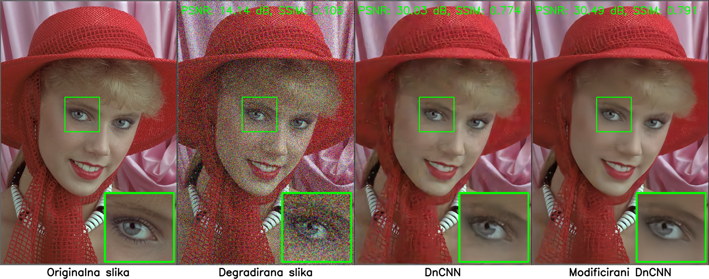
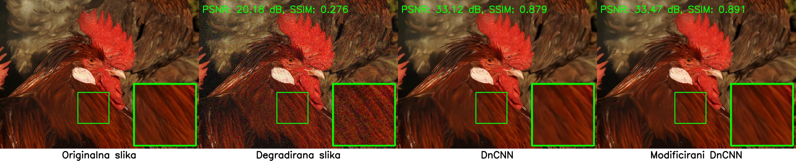

# Modified DnCNN with Residual Blocks

## Overview
This project was developed as part of a master’s thesis.  

The main contribution of this work is the modification of the existing **DnCNN architecture** by introducing **residual blocks** to improve the model’s efficiency and training stability. The model was trained and tested on synthetically degraded images with various types of noise.  

In addition, the BSD dataset was extended with an additional **600 training images** containing more specific and diverse patterns that were not originally present in the standard BSD dataset. This extension was introduced to improve the generalization ability of the model.  

Evaluation was performed both quantitatively using PSNR and SSIM metrics, and qualitatively through visual analysis of the results.

### Architecture Diagram

Below is the architecture of the modified DnCNN with residual blocks:

---

## Quantitative Results

### Grayscale Datasets (Set12, BSD68, Urban100)

**DnCNN (baseline)**

| Noise Level | Metric | Set12 | BSD68 | Urban100 |
|-------------|--------|-------|-------|----------|
| σ = 15      | PSNR   | 32.71 | 31.74 | 32.64    |
| σ = 25      | PSNR   | 30.36 | 29.23 | 29.95    |
| σ = 50      | PSNR   | 27.16 | 26.23 | 26.26    |
| σ = 15      | SSIM   | 0.903 | 0.891 | 0.924    |
| σ = 25      | SSIM   | 0.862 | 0.830 | 0.878    |
| σ = 50      | SSIM   | 0.783 | 0.719 | 0.785    |

**Modified DnCNN**

| Noise Level | Metric | Set12 | BSD68 | Urban100 |
|-------------|--------|-------|-------|----------|
| σ = 15      | PSNR   | 32.93 | 31.73 | 32.86    |
| σ = 25      | PSNR   | 30.62 | 29.29 | 30.39    |
| σ = 50      | PSNR   | 27.50 | 26.38 | 27.01    |
| σ = 15      | SSIM   | 0.907 | 0.898 | 0.933    |
| σ = 25      | SSIM   | 0.869 | 0.837 | 0.898    |
| σ = 50      | SSIM   | 0.793 | 0.728 | 0.819    |

---

### Color Datasets (McMaster, CBSD68, Kodak24)

**DnCNN (baseline)**

| Noise Level | Metric | McMaster | CBSD68 | Kodak24 |
|-------------|--------|----------|--------|---------|
| σ = 15      | PSNR   | 33.45    | 33.89  | 34.60   |
| σ = 25      | PSNR   | 31.52    | 31.23  | 32.14   |
| σ = 50      | PSNR   | 28.62    | 27.92  | 28.85   |
| σ = 15      | SSIM   | 0.916    | 0.930  | 0.925   |
| σ = 25      | SSIM   | 0.882    | 0.886  | 0.883   |
| σ = 50      | SSIM   | 0.812    | 0.795  | 0.799   |

**Modified DnCNN**

| Noise Level | Metric | McMaster | CBSD68 | Kodak24 |
|-------------|--------|----------|--------|---------|
| σ = 15      | PSNR   | 34.65    | 33.96  | 35.09   |
| σ = 25      | PSNR   | 32.51    | 31.38  | 32.64   |
| σ = 50      | PSNR   | 29.52    | 28.20  | 29.53   |
| σ = 15      | SSIM   | 0.925    | 0.933  | 0.929   |
| σ = 25      | SSIM   | 0.894    | 0.890  | 0.889   |
| σ = 50      | SSIM   | 0.830    | 0.803  | 0.810   |

---

## Qualitative Results

Below are two visual comparisons between the baseline DnCNN and the modified architecture. Each image shows four examples placed side by side horizontally:

- **First:** Original image  
- **Second:** Degraded image with Gaussian noise  
- **Third:** Output from the baseline DnCNN model  
- **Fourth:** Output from the modified DnCNN model  

**Example 1:**  

**Example 2:**  

**Example 3:**  

## License
This project is based on [SaoYan/DnCNN-PyTorch](https://github.com/SaoYan/DnCNN-PyTorch), which is licensed under the **GNU General Public License v3.0**.  
All modifications (2025) are also distributed under the same license. See [LICENSE](./LICENSE.txt) for details.
